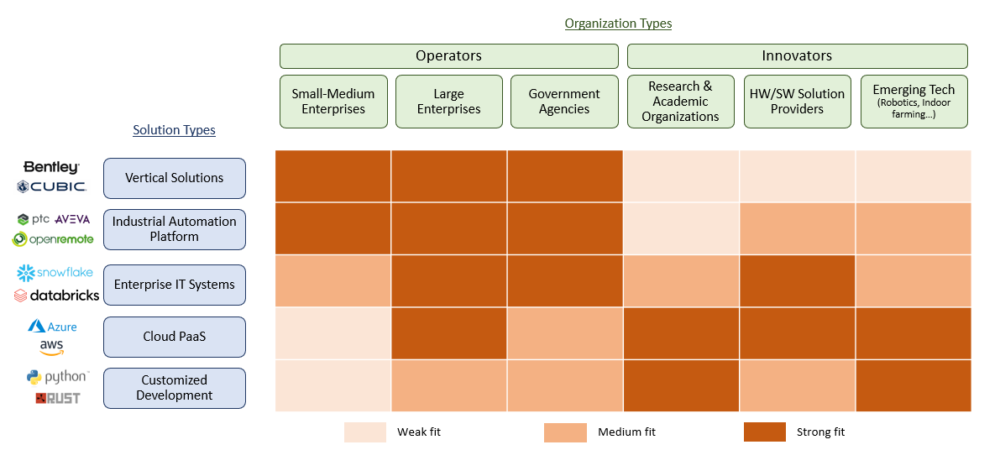
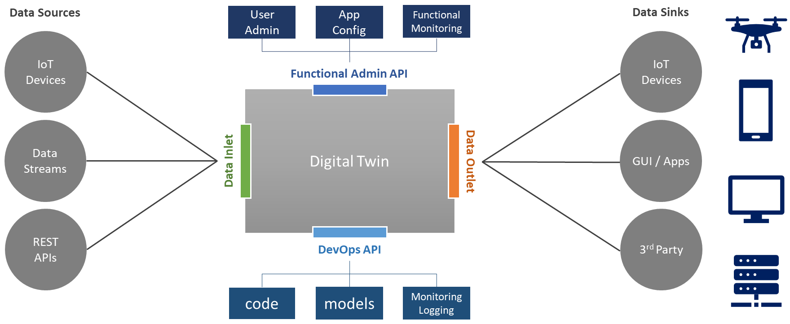
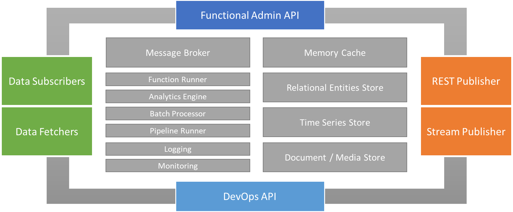
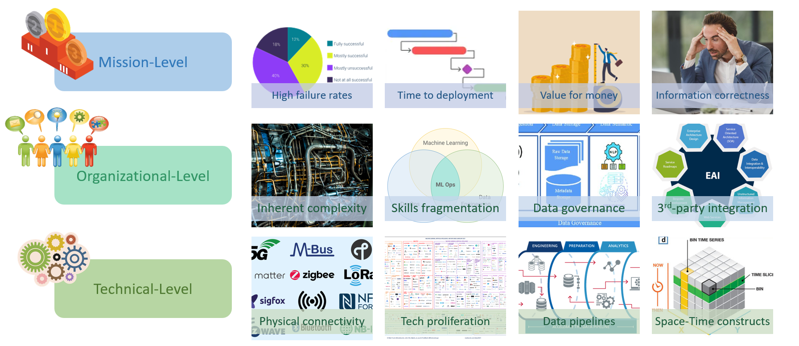
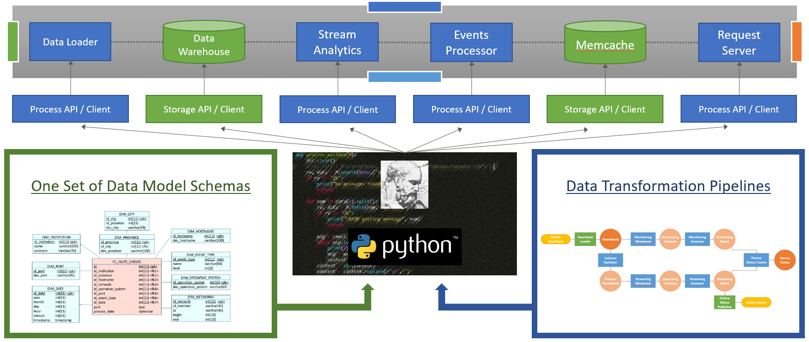
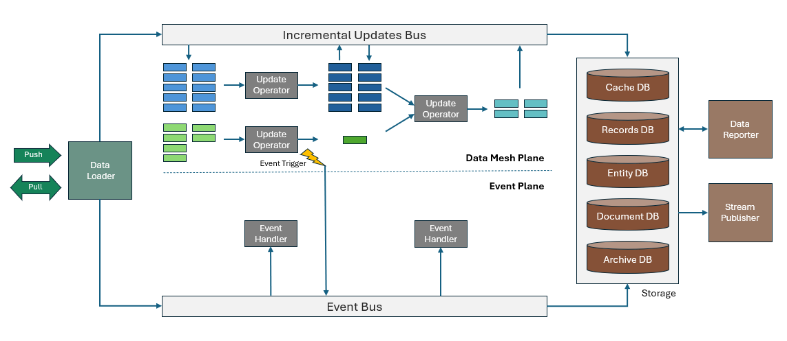
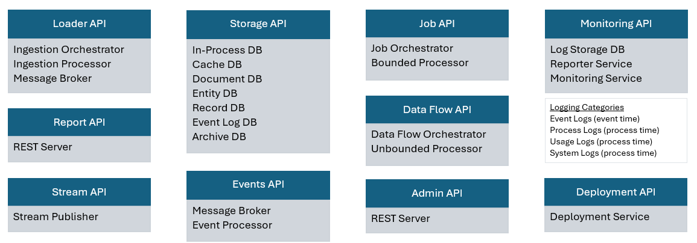
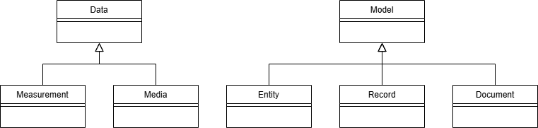

# Anaximander Value Hypotheses
> **Preface**
>
> This document is an internal articulation of the Anaximander project’s foundational assumptions — about its users, its purpose, and the nature of the solution it proposes. It aims to clarify the value hypotheses that guide the project and expose them to reflection, iteration, and eventual validation.
>
> At this stage, "we" refers to a small, independent development effort. The document is intended primarily for potential contributors and sponsors who are willing to engage with the framework at a formative stage. It is also a personal synthesis of several years of inquiry into how digital twin systems are designed and deployed, and how to radically democratize the software infrastructure stack for domain experts and data scientists.
>
> The document is organized in two parts: first, an examination of the latent needs shared across digital twin applications and their users; second, a description of Anaximander’s proposed response in the form of a modeling framework, architectural pattern, and code-generation toolchain.

## Executive Summary

Anaximander is an open-source modeling framework designed to simplify and unify the development of software systems that represent and respond to physical-world operations — commonly known as digital twins. It targets application developers, data scientists, and engineers working in operational, planning and research contexts across sectors such as manufacturing, utilities, mobility, environmental monitoring, and other industrial domains, with an emphasis on Internet-of-Things (IoT) and Machine Learning (ML) or Artificial Intelligence (AI) capabilities.

We believe that:

- **Digital twins are everywhere, but rarely recognized as a general category.** Today’s SCADA systems, decision support tools, predictive maintenance dashboards, and IoT orchestration platforms all share core structural features — yet each is built from scratch, using inconsistent paradigms.

- **There is a latent need for a shared blueprint.** Across industries, developers struggle with the same implementation patterns: incremental data ingestion, multimodal data composition, duplicative declarations across service layers, brittle data pipelines and data discoverability and governance challenges. These could be normalized and abstracted into a common representational language and code framework.

- **Anaximander offers a generative programming model that targets this shared structure.** At its core, the framework provides a domain-specific modeling language implemented in Python, along with a compiler that generates database schemas, APIs, orchestration logic, and other infrastructure scaffolding. The result is a complete, programmable backend — optimized for iteration and clarity.

- **The goal is to reduce the cost, complexity, and brittleness of digital twin systems.** By making modeling the center of gravity, Anaximander aims to free teams from “negative engineering” — the low-leverage work of stitching together components — and help them focus instead on meaningful representations of the real world.

Over time, we envision Anaximander enabling a network of interoperable models — a kind of “digital twinternet” — where domain-specific systems can compose, exchange knowledge, and evolve together. While the ideas in this document are ambitious, they are presented as hypotheses — to be explored, tested, and refined with the help of others.

## Introduction

This document is intended to capture our present understanding of opportunities and barriers for Anaximander to create economic value, in the form of purposeful software application deployments. Accordingly, it is organized as follows:

* Part 1: Needs hypotheses

  * User profiles

  * Functional needs

  * Managerial needs

  * Developer needs

  * Landscape of opportunity

* Part 2: Solution hypotheses

  * Framework concept
  * Systems architecture
  * Programming interface
  * Deployment and administration
  * Related work and modeling paradigms

Part 1 focuses on synthesizing a set of needs shared by a broad range of organizations that need to build, operate and maintain software applications to manage physical world operations. Precisely, we hypothesize that most of these applications are reducible to a so-called digital twin — a representational model of the physical domain that the application deals with. Hence it is a critical project gate whether this hypothesis is both valid and accepted by the target audience.

Part 2 describes in broad strokes what is currently known of the solution, including the overall concept, the proposed breakdown into composable software services, the programming interface, further comprised of a modeling language and an object-oriented interface, and the deployment and administration of a complete system. The purpose of part 2 is to articulate just enough of the solution that it demonstrates its ability to uniquely meet the needs described in part 1, and to expose key design hypotheses that may need to be examined.

## Part 1: Needs hypotheses

Broadly, Anaximander is designed to help teams of engineers and scientists build software applications that model physical world features and operations, from aggregating weather station measurements to predicting industrial production to training self-driving car AI components.

Throughout the world, and across dozens of industries, organizations of varying missions and sizes provision and operate a similar type of software applications: these may be called "SCADA" (Supervisory Control and Data Acquisition), "MES" (Manufacturing Execution System), "DSS" (Decision Support System), or more modestly "historian" or "dashboard". The common thread is that these applications pick up information about physical world assets or ambient conditions, and provide synthesis, alerts, predictions or ready-made decisions that influence the actions that these organizations take.

For our purpose, and from here on, we will designate these applications as "digital twins". This eloquent term is quickly grasped, yet can lead to confusion as it is used differently in different contexts, so let us clarify it. In the most literal sense, a digital twin is a computer-based representation of a system. The system could be an electrical power grid, a single bacteria, or even a game of Fortnite — in other words, the system itself could be either genuinely physical or digital, but it has a concrete embodiment with temporal and spatial characteristics.

Under this definition, in spite of the relative novelty of the designation, digital twins are as old as computer technology itself: weather models that motivated early investments in super-computing are a prime example. And while the definition should not be interpreted too broadly — for instance, accounting software, word processors, and e-commerce websites are not digital twins, the term is often used in a more restrictive sense. For one, it can evoke a physical 3-D model, say for a complex power turbine, but a simple predictive maintenance application that merely compares time series of sensor readings to predefined thresholds is also a digital twin. Another use of the term is as a state monitoring and configuration tool for IoT devices — which is fine, but to some extent steals meaning from the broader business purpose that the IoT application aims to fulfill. 

Regardless, the need to provide these notional pointers belies the fact that this categorization has generally escaped typical accounts of the business software landscape. We believe that there are a couple of reasons for this:

1. In practice, there hasn't been generic digital twin solutions. Instead, every industry has developed function-specific lines of software to meet its needs.
2. Also historically, software engineering has organized around building components such as databases, application servers and user interfaces. In this perspective, a digital twin is just another business application.

Hence, neither the solutions market nor the software production process have a natural affinity with the concept of a digital twin. And yet, the core hypothesis underlying the genesis of the Anaximander framework is that there is a latent need for developing digital twins for different industries and use cases based on a common blueprint. That blueprint effectively aligns with the broad pattern of the "modern data stack", but the focus on industrial applications tilts the design objectives toward more emphasis on modeling and correctness, even at the expense of latency and efficiency — which tend to dominate the data engineering landscape at the cutting edge.

In the next sections, we further clarify the intended scope of the framework, first by enumerating the types of organizations that may benefit from it, and then by mapping different kinds of applications and use cases to a limited set of functional requirements. The remaining two sections in the first part of the document address the interests of the key decision-making constituencies, namely organization managers and the engineers who are the direct users of the framework.

### User profiles

In this section, we attempt to enumerate and categorize organizations that use digital twins as part of their business process. The first and most obvious broad category is industrial companies engaged in physical world operations, which include natural resources extraction, power generation, agriculture and land management, manufacturing, transportation and logistics, utilities and telecommunications distribution networks, construction, waste management and other forms of assets or process management. We don't include sectors such as healthcare, finance or real estate, mostly because they have unique regulatory and security requirements that may not be compatible with a general-purpose industrial solution.

Within each industry, organizations may play one or more of the typical roles of planning, designing, building, operating, maintaining, servicing or retiring natural or artificial assets. Additionally, academic institutions and research laboratories are prime consumers of digital twin technologies in support of engineering and scientific activities. Likewise, government agencies use digital twins, whether they act in an operational, incitative, or regulatory capacity. Finally, a special mention goes to startup enterprises that bring innovations to market. These include IoT solution providers, robotics companies, and so-called "green tech" startups that typically combine novel physical processes with digital technology from the ground up.

Taken together, this extensive audience represents 25 to 35% of the US Economy[^1] on a value-added basis, and likely closer to 50% worldwide. This translates to a portfolio of economic activities totaling tens of trillions of dollars annually. While it is difficult to extrapolate the corresponding level of information technology spending, it numbers in the hundreds of billions of dollars. For instance, IoT analytics estimates that the global industrial software market alone reached $146 billion in 2023[^2]. 

As we will describe in the next section, the use cases are broad and varied. However organizations select solutions on other criteria than the use case alone, including their scale, structure and maturity level. The next question for Anaximander is which organizations are most likely to find it suitable. Here we can look at current purchasing behavior patterns to get a clue. For this purpose, we hypothesize a breakdown of organization types into six categories. Note that these categories focus on owner-operators of digital twins, excluding the contractors and service organizations that may also be involved in decision-making and implementation, but as agents rather than principals. The first categorization separates pure operators from innovators, further subdivided as follows:

* **Operators** — organizations that orchestrate physical world operations as their primary mission
  * **Small and medium-size enterprises** — these could be small manufacturers, freight operators, construction firms, etc.
  * **Large enterprises** — these include large manufacturers, oil & gas companies, telecommunications networks, etc.
  * **Government agencies** — local and state agencies that are also industrial operators, such as ports, airports, highway and public transit agencies, power and utility distribution networks.
* **Innovators** — organizations that focus on innovation to either serve operators or eventually displace them
  * **Research & academic organizations** — corporate or academic labs that collect and model field data.
  * **Solution providers** — hardware and/or software vendors that provide safety or efficiency improvements to operators, such as plant equipment, novel instruments, or decision support tools. 
  * **Emerging technology actors** — startup or growth organizations that bring disruptive innovations to market, such as robotics or novel processes. The difference with solution providers may not always be obvious, but the criteria revolve around both the depth and scale of innovation.

If we now turn to the types of software solutions that these organizations may select, we identify the following categories:

* **Vertical software solutions** — these are industry-specific solutions, such as a transportation network simulation suite or a forestry management application.
* **Industrial automation platforms** — these software platforms, such as products from Rockwell, Schneider, PTC and the likes, have a more general purpose than vertical solutions but are similarly intended as relatively standardized and complete offerings.
* **Enterprise IT systems** — this category is even more general, comprising databases, analytics systems, dashboarding technologies and more that can be composed to form customized solutions.
* **Cloud PaaS** — Hyperscalers typically offer the most generic storage and compute solutions, not unlike enterprise IT systems but in a more self-serve distribution model.
* **Ad-hoc development** — in some cases, organizations may turn to developing software components from scratch to meet specific scale or latency needs.

All told, we can cross the organization and solution types to form the following matrix, which sets forth our hypotheses about their relative affinities:



Here are some of the assumptions underlying the affinity matrix:

* **Small-medium operators** will usually select the most integrated solutions. This reflects the facts that most of them fall into typical use cases, and their resources for customization are limited.
* **Large operators** tap from the entire spectrum of available solutions, turning to lower-level components or customized development when facing unusual use cases or attempting to optimize their total cost of ownership.
* **Government agencies** exhibit a similar profile to private operators, with a usually lower appetite for do-it-yourself solutions, although some of the larger agencies have the resources and savvy to implement customized software.
* **Research organizations** behave very differently: they will rarely purchase industry-tailored solutions and rely on generic components to build software. This stems from both a cultural preference, as scientists and engineers are inclined to build their own tools, as well as dealing with the unique requirements of their research objectives.
* **Solution providers** need software customized to their product and will tend to select general-purpose software components, rather than pick a vertical solution that could appear competitive to their own offering. At the same time, they may not want to develop from scratch unless they have to because they are looking for go-to-market velocity and focus engineering resources on their core competencies.
* **Emerging technology actors** behave similarly to research organizations, though with generally more openness to industrial automation platforms in areas where deep customization is not required.

This matrix helps in establishing user profiles that are most likely to respond positively to the opportunity afforded by Anaximander. In particular, the short-term focus will likely be on innovators.

### Functional needs

In the previous section, we enumerated organization types and their overall purchasing behavior, with no specific regards given to the various use cases they may implement. This is the topic that we turn to in this section. We start at a high level with a list of functional use cases. We then decompose these use cases to show that they are reducible to a set of generic software functions.

Following our earlier definition of a digital twin, we can derive the following list of functional use cases:

* **Environmental models** — this category encompasses applications that track environmental conditions (e.g. atmospheric conditions, water or soil chemistry, snow depth...), possibly applying inverse modeling techniques to derive a system-wide state estimation from sparse measurements.
* **Operations monitoring** — this broad category consists in supporting operational decision making, either in near real-time or in deferred time. This includes applications such as transportation or utility network monitoring and control, manufacturing quality control, and generally estimating key performance indicators like safety and efficiency for industrial-scale activities.
* **Planning & simulation** — extending the previous use cases, digital twins may aim to model future or hypothetical operational scenarios in order to guide longer-term decisions, though in some cases simulations could support near real-time decision making. The modeling itself may greatly vary in complexity, leveraging statistical techniques as well as full-blown dynamic state evolution laws. Operator training is another important use case that can be rolled under this category.
* **Process control & automation** — the above use cases mostly focus on state estimation from field measurements. Digital twins may also be used in the opposite direction to implement automated actions. For instance, a digital twin may automatically order parts and refills to keep the supply chain afloat, or it could implement different signal timing strategies to control roadway traffic intersections. More generically, notification and alerting functions fall under this category.
* **Assets management** — at the bare minimum, this functional use case may simply provide inventory tracking. Combined with a historical archive and modeling capabilities, more sophisticated applications are enabled for predictive maintenance, security or lifecycle management.

While every domain brings different combinations of input data, terminology and control variables, each of the above use cases implements somewhat predictable computing patterns. The core hypothesis put forth in this section is in fact that all these use cases can be realized as a combination of basic services, which are as follows:

* **Data ingestion** — data needs to be loaded from field devices and external sources. This can be set up in a few different ways (push or pull, stateless or stream), and may involve data transformations. However there is only a handful of patterns to choose from, and there are complete solutions available, including open source options such as Airbyte.
* **Data storage** — data storage is likely to require multiple services to accommodate different types of data, but again the options can be enumerated readily. These include:
  * Representations of physical world entities (assets, sensing devices, geolocations...), whose properties are either static or slowly changing, and are best stored as serialized objects or rows in a relational database. In some cases a graph database may be warranted, but in most practical situations a relational database is the best fit;
  * Representations of time series, which include measurements, events and states. Typically these are the most voluminous data sets and they may be distributed across multiple repositories based on their recency — e.g. cache store for very recent data, database or lake house storage for frequently queried data, and data lake archive for old data;
  * Media objects such as images, video or other sensor recordings, as well as machine learning models, that are stored as individual documents in a data lake;
  * Representations of configurations and specifications as nested mappings, which are often stored as semi-structured documents such as JSON or YAML files.

* **Analytics engine** — next is an analytics engine that can execute featurization and summarization pipelines. This could be implemented directly in a data warehouse, or use a streaming analytics engine for low latency materialization, or a batch engine — though either way, the programming logic needs to accommodate unbounded data sets that are processed incrementally.
* **Event broker** — most digital twin implementations define events that may trigger notifications or automated actions. An event broker is required to provide a robust backbone for event publication and subscription.
* **Event handling engine** — event handling logic requires an execution environment and orchestration. Cloud functions typically provide a great solution for this need.
* **Job engine** — a digital twin will generally need to execute various processes. These include analytics and event handlers as described above, but there may be a need to handle larger jobs such as ML/AI training or simulation runs. There is a further dichotomy between bounded jobs and unbounded jobs. Bounded jobs are provided resources to run a predefined task, after which the resources are released. Unbounded jobs run continuously — and may be called "pipelines" rather than jobs.
* **Data publisher** — a mirror service to data ingestion is data publication, which again can be set up in a few different ways. It is a safe bet to assume that this will involve a combination of a REST API and possibly a streaming API such as web sockets.
* **Data administration** — this service, which may be enabled by either a command-line interface or a graphical user interface, allows application administrative users to create, update and delete data. It may also be combined with a scheduler, event broker and cloud functions to automate certain administrative functions, such as archiving of data beyond a certain expiration threshold.
* **Logs and monitoring** — in order to monitor, administer and debug the digital twin, every system event needs to be logged, and key performance indicators need to be accessible and possibly trigger notifications — either using the digital twin's event broker or a built-in solution bundled with the monitoring service.

Additional components may be added, such as graphical interfaces or dashboards for application end-users, or a data science and ML platform. However, these are terminal services, in that they must interact with the digital twin backend but are unlikely to be integrated with other applications, and are therefore more easily interchangeable.

Some of these services are external-facing — data ingestion and data publication are the most obvious examples, while others such as the event broker are part of the internal backbone. Hence to provide a complete picture, it is helpful to first propose a basic grouping of functions that starts with the exposed system interfaces, and then augment it with the full list of services.




Here we show four main system interfaces:

* A data inlet for ingestion of external event and time series data
* A data outlet for publication of all the exposed data, which may be provided as a combination of pull (i.e. RESTful) and push (i.e. streaming) APIs
* A functional administration interface for operators of the system, comprising user administration, application configuration, and functional, system-wide monitoring (i.e. status, notifications, etc.)
* A development interface for software engineers, data scientists and ML engineers that allows for code and model updates, as well as technical introspection through service-level monitoring and logs.

We can now zoom into the digital twin itself to show a complete list of services that enable it.



To be sure, what we are showing here is no different from a generic IoT backend architecture, or some would say, a data stack, but that is precisely the point. If we turn back to the functional use cases, it can be quickly verified that in principle they can all be implemented using the above architecture. Of course, every deployment differs in the following ways:

* Volume and frequency of input data
* Computational cost of data transformations
* Performance bottlenecks
* Need for specialized components or libraries to handle certain tasks or data types
* Stack preference, either culturally conditioned or owing to integration with a larger enterprise ecosystem

These differences suggest that system architects and developers always study a use case carefully before designing for it, and that the resulting stack varies accordingly. Our contention is that the vast majority of digital twin applications can be served more than satisfactorily by a generic architecture and a set of standardized backend services — with possibly several options available from some of these services. One key reason for this is that cloud computing platforms have been engineered for big data use cases encountered by large enterprises. What are the sources of so-called big data? Cursory research reveals the following list:

* First and foremost, connected media data: web and social media activity, e-commerce, digital advertising...
* Data center operations: computers are quite capable of generating sufficient data to overwhelm themselves! We could also tack on telecommunications network operations, which likewise generate humongous volumes.
* The healthcare and finance industry feature prominently since they are both used by virtually everyone, are highly connected, and uniquely centralized and regulated.

Then comes the industrial sectors targeted by Anaximander, such as manufacturing and transportation, as well as scientific research. While it is true that these sectors can generate large volume of sensor (especially video) or machine log data, there are a few differences. One key difference is that the business value of operational data on a per-volume basis is vastly less than that of commercial data. In turn, this means that it is not subject to the same depth of storage and processing. Along the same lines, older operational data becomes stale very quickly and can more easily be discarded, save for useful historical summaries that tend to be compact. To be sure, there are examples to the contrary, and robotics applications such as autonomous driving provide the perfect counterpoint. However, the key question or hypothesis here is whether digital twins of physical world operations can be effectively implemented by a generic cloud stack, and we believe the answer is unequivocally positive — but some additional level of analysis and validation may be in order.

### Managerial needs

The selection of a development framework for a digital twin application is sure to involve multiple constituencies within an organization. For the purpose of this document, we focus on the two most essential functions involved in decision-making: top management and the engineering teams responsible for the development and operations of the application. This section covers managerial needs.

Managerial needs depend on the type of organization. Since we have already hypothesized that Anaximander will initially focus on innovators, we will pay closer attention to the corresponding organization types. However we can still enumerate a set of needs that are likely common to all organizations:

* **Total cost of ownership** is going to be an essential driving factor no matter what the setting is. While this is conceptually obvious, it is also wickedly difficult to estimate — who knows at the onset what a system will take to maintain in the long run? Further, does the management team have the depth of competency to understand all the trade-offs involved? And to wit, an early stage startup CEO will care more about short-term value creation, even at the risk of accumulating technical debt — reasoning, though often erroneously, that the system will be rebuilt after the next round of funding. But by the same token, technical founders may overly focus on optimizing cloud computing costs when in fact their primary burden is developers salaries. Hence at the end of the day, what matters most to managerial decision-making is the *perceived* cost of ownership, and what factors influence that perception.
* **Time to deployment** is another key variable — depending on the context we may refer to it as "time to market" or "time to value", but either way this captures the desire for timely execution and delivery. Using the example of the startup CEO again, it is clear that perceived time to market is going to weigh overwhelmingly on their decision. 
* **Stakeholder satisfaction** is the ultimate yardstick by which to measure project success, and good management teams will live by this mantra, whether the stakeholders are customers, research sponsors, or an internal team. In practical terms, this means that managers will be sensitive to the flexibility and resilience of a particular solution set, anticipating that requirements might change and that things rarely go according to the initial plan.

Let us now turn to the specific managerial needs of research organizations, solution providers and technology disruptors, respectively.

#### Research organizations

Research organizations, whether academic or corporate, tend to be deeply rooted in scientific and/or engineering culture. On the administrative side, there is typically a split between managerial scientists and career administrators. At the risk of sounding caricatural, scientists want to tinker, publish and boast. Administrators seek compliance, due process and a reliable end time to their workday. As such they can grow weary of the free-spirited nature of researchers, and therefore suspicious. The glue that holds the edifice together is the research sponsorship, whose interests will ultimately prevail. 

Whether managers get involved in the decision-making regarding a software framework is highly dependent on the scope and scale of the project. In most cases, engineers will have complete leeway on picking the technology they need, especially if it is open-source software. This may change in a couple of cases:

1. In a project with large stakes, principals and administrators will have a say — as could the research sponsors. In our experience, the default position will usually be risk-minimization. The exception would be in a case where computing requirements are an integral part of the research project, forcing the team to seek a cutting edge solution.
2. Another use case would be if a digital twin project is a lab-wide or department-wide endeavor — for instance, a transportation research department could decide to invest in a unified tool to make data more easily accessible and interchangeable among research staff. This might call for a traditional procurement process, and at that point administrators might even take the lead over scientists.

#### Solution providers

Solution providers that incorporate digital twin technology in their product need a functional, secure and performant software stack to even have a shot at success in the marketplace. In a startup environment, there is the added pressure to show results quickly and incrementally. Hence there is a bit of a tension between meeting the needs of customers, who may themselves be large enterprises with restrictive information technology policies, and following a path of innovation that demonstrates rapid iterations and a willingness to try untested routes. 

Managers will likely prioritize velocity and a high level of agency in their approach to software engineering development, while ensuring that security and performance are met. This is why hyperscale cloud technologies are particularly attractive to this user profile — they combine a DIY approach with robust components, and also offer a consumption-based cost curve that works great for early stage development.

These managers will not be particularly interested in trying out a brand new framework given the risks. However on this front, Anaximander may still come out ahead in the sense that it is primarily designed as a code generator for well established components, including both open source Python libraries and cloud client libraries. The key hypothesis here is that solution providers can be sold on a rapid go-to-market value proposition.

#### Technology disruptors

Organizations that develop very ambitious technology sit somewhere between solution providers and research organizations. They face commercialization imperatives, but may have somewhat longer time horizons than a SaaS provider. Like research organizations, they tend to have a deep scientific and engineering culture, and the founding team is more likely to be made up of seasoned and/or highly talented scientists. In some cases, depending on the nature of the core technology, this may bring a high level of software engineering expertise and maturity to the organization. However the opposite may also be true and digital infrastructure could be perceived as, well... infrastructure that just needs to work and not cost an arm and a leg. The former is more likely to prefer custom, DIY solutions, whereas the latter may quickly turn to vendors.

The common thread, however, is that management is making big bets, and this attitude will extend to software stack decisions. This means that the ability to scale in order to take over the whole world, per the business plan, is a key criteria. We believe these managers are also more prone to listening to their engineering staff, because they may be eying multi-year development and need to keep their workforce content and productive. Along these lines, data science and machine learning operations are likely to receive a lot of attention as well.

### Developer needs

In this section we turn to the end users of the Anaximander framework: domain experts, data scientists, data engineers and software engineers. They are the designers, developers and maintainers of digital twin applications. They themselves are catering to the end users of these applications, who may be domain technicians, operations managers or equipment operators — though the lines can be blurred in R&D projects in which developers are also users.

The overarching objective of these developers aligns with managerial needs: meeting user requirements in time and on budget. As it turns out, this objective is notoriously hard to meet for enterprise IT projects in general, and particularly so for IoT projects[^3] -which provide a good proxy for digital twin applications in general. Here we get to approach the substantive problems that Anaximander aim to solve. The following chart enumerates these problems in broad strokes, breaking them apart into three levels: mission delivery, organizational management, and technical challenges.



Let us examine these problems in slightly more details:

* **High failure rates** — of course this is both the most important but also the least specific problem, as there are myriad ways in which a project can fail. However it highlights the need for robust planning and mitigation strategies, and the selection of the technology stack is certainly a big part of this.
* **Time to deployment** — this is in many way correlated to the previous point, but there are some unique features of digital twin applications that are worth noting here. The interface with physical world operations adds a set of contingencies to the usual challenges of enterprise software delivery:
  * Physical operations environments are difficult to manage. They can involve large populations of workers who experience daily pressure and view change with apprehension and suspicion. They are subject to seasonal trends and events that can easily derail schedules. 
  * Software deployment often depends on hardware first, which generates a lot of additional schedule risk.
* **Value for money** — this item addresses the case where an application is delivered according to specifications, but still doesn't offer the expected return-on-investment. Again, physical operations make this uniquely difficult. In particular, we have seen decision support systems for air traffic or highway management be deployed only to be ignored by the vast majority of operators. This challenge is often more managerial than technical, but it can be mitigated by a tool that provides flexibility and rapid iterations against evolving requirements.
* **Information correctness** — digital twins are models and all models are approximations. Further, interfacing the physical and digital worlds is fraught with errors: sensors become miscalibrated, power and communication links break in both small and big ways, and software processes have to accommodate late or missing data. As a result, applications can end up providing incorrect information, which is sometimes obvious and sometimes not. This can have very negative consequences. In many cases, wrong information is a lot worse than no information. Incorrect information also damages the trust of end users in an application, which can completely undermine its business value.
* **Inherent complexity** — digital twin applications are inherently complex endeavors that require coordination between different teams and stakeholders with myriad interdependencies. One aggravating factor that is specific to digital twin is what we would call the "messiness of the natural world", which is clearly a hand waive, but nonetheless an empirical truth. Another way to describe it in software engineering parlance is to say that the natural world is ripe with edge cases that are difficult to foresee. Using specialized frameworks that are designed to handle some of that messiness is generally a good idea.
* **Skills fragmentation** — designing and delivering a digital twin application requires a lot of different skills and few individuals hold them all. This can lead to communication gaps and misunderstandings between professionals of different stripes. The primary divide is between 3 poles of competency: the domain expertise, the software and data engineering expertise, and the machine learning and data science expertise. 
* **Data governance** — in recent years, data governance has become a critical topic for enterprises. This umbrella term underscores the rise of data as a business asset that requires cultivation and protection. Data governance encompasses security, regulatory compliance, authorized uses, sharing policies, cataloguing, lineage and more... The challenges may be slightly less acute with machine data as compared to personal data, but the consequences of errors can still reach catastrophic levels and the diversity of data sources increase complexity.
* **Third-party integration** — in our assessment, systems integration remains the most vexing and enduring problem plaguing the information age, limiting the overall business value of software and incurring tremendous costs. One specific aspect of this challenge is the integration of legacy systems that the enterprise needs to compose with. Another challenge that is specific to industrial environments is the joining of embedded Operational Technology (OT) with enterprise Information Technology (IT).
* **Physical connectivity** — maybe the most obvious "real world" challenge of digitizing operations is the connectivity of IoT devices. To be clear, this is also the item in this list to which Anaximander is least likely to provide answers. However, beyond improving the reliability and security of device connectivity, this also means that digital twin developers must design software that can inherently handle late and missing data, which can be much trickier than it appears.
* **Tech proliferation** — open source and cloud computing have radically democratized software development over the last two decades. However this can be a curse as much as it is a blessing. This plays out in a couple of different ways. First, it can be daunting for architects and engineers to select a stack and stick with it. Just keeping up with all forms of data technologies that emerge every month represents a substantial task. In turn, this means that valuable time is spent at the onset of every project evaluating different libraries, cloud services and vendor solutions. Second, the diversity of technical options also feed into the skills fragmentation problem described above.
* **Data pipelines** — here we start to descend down into the weeds of building and operating data-intensive software. In the abstract, data pipelines are transformation and transfer operations that get called repeatedly, either through discrete invocations or as long-running processes. In practice, these are notoriously difficult to handle. The primary reason is that modern data pipelines are distributed systems, and distributed systems are hard to get right, with challenges ranging from concurrency to capacity mismatches and breaking interface changes. Another challenge is observability, or how to monitor performance, anticipate bottlenecks, and most of all diagnose and fix errors. Data transformation pipelines are often compiled from a functional programming interface, which is a good fit but can also make debugging very challenging. When combined with the propensity of the natural world to come up with unforeseen edge cases, this creates an ongoing maintenance burden. Finally, many pipelines are designed for nominal use, but a complete system must also be capable of recovering from failures, handling functional updates, and backfilling late or missing data, which all add significant complexity.
* **Space-time constructs** — digital twins of physical operations obviously have to contend with the concepts of time and space. As it turns out, these create peculiar programming challenges that may not have received the attention they deserve to date, as software engineers are incentivized to just make things work, not to become metaphysicians. The challenges include in no particular order:
  * Handling and converting between diverse and highly technical representation formats, including time zones and geospatial referencing systems
  * Dealing with the continuous nature of time and space in a digital system that is founded on discreet bits
  * Properly reasoning about event time (i.e. the modeling timeline) and system time (i.e. the processing timeline)
  * While there are frameworks and programming abstractions that deal with time, and others that deal with geometry and geophysics, the combination of space and time (e.g. a trajectory) is still mostly regarded as a specialized and/or complex use case that very few tools are designed to handle out of the box
  * Computational geometry, which is nothing more than algorithms suited for 2-D or 3-D Euclidian geometry, turns out surprising and non-intuitive edge cases that trigger bugs

### Landscape of opportunity

In this last subsection, we now focus our attention on some of the structural challenges of building digital twin applications and how they are addressed today. Across industries, teams tasked with building operational systems — whether robotics startups, renewable energy companies, or research groups — deal with complex tasks that pose enduring difficulties:

- Modeling entities that slowly evolve over time, which creates a tension between efficiency and correctness
- Concurrently managing streams of dense telemetry data (typically sensor readings) and sparse observational data (discrete events)
- Handling system states, asynchronous updates, and real-time actions while maintaining a legible architecture
- Integrating heterogeneous data sources and orchestrating workflows, which tends to push complexity outside of code and into complex distributed environments
- Scaling from proof-of-concept prototypes to robust operational deployments, and bridging from data science notebooks to production environments

These challenges are not incidental; they arise from deep and persistent gaps in how we represent real-world complexity within software systems. Data warehouse architects have developed modeling techniques and design patterns to deal with these problems, but these remain the exclusive realm of large enterprises, and can be difficult to implement with state-of-the-art stacks that offer high performance-cost ratios but lack depth of functionality. Without a coherent modeling framework, practitioners are forced into brittle, ad hoc architectures that entangle data processing, storage, control, and domain logic. As a result, teams rebuild fragile internal frameworks — informal data contracts, custom pipeline scaffolding, brittle database schemas — each time they embark on a new project. This situation increases costs, extends development timelines, and ultimately limits the adaptability of deployed systems. Here are some concrete and relatable examples:

- A university lab monitoring greenhouse conditions painstakingly defines sensor types, measurement schemas, and dashboard views — only to repeat the process for a different experimental setup.
- An energy startup tracks turbine health using ad hoc telemetry pipelines, struggling to integrate maintenance records, operational states, and predictive models.
- A mobility company simulates fleet behavior but separately manages real-world deployment APIs, creating redundant, unsynchronized representations of vehicles.

In every case, the cognitive overhead and engineering burden grow unnecessarily. The hypothesized opportunity is to create a unified modeling framework that:

- Expresses real-world operational systems declaratively and compactly
- Bridges the gap between domain modeling and system deployment
- Eliminates negative engineering by automating scaffolding and infrastructure generation
- Fosters reusable, composable, and evolvable models across domains

As we will see in the next part, Anaximander aims to fill this gap — providing not just a library, but a shift in the center of gravity for how operational systems are conceived, built, and evolved. In doing so, it offers the potential to radically reduce the cost, complexity, and brittleness of digital twin development across industries.

## Part 2: Solution hypotheses

In this part, we turn to a high-level description of the Anaximander framework as currently envisioned. Evidently, there are both explicit and implicit assumptions underlying this vision, and one of the goals of this section is to expose them so that they can be examined and adjusted based on external inputs. Another goal is to establish an initial development target that is rooted in user needs.

### Framework concept

The genesis of the Anaximander framework is explained in more details in the [statement of purpose](https://github.com/novavia/anaximander/blob/main/docs/Anaximander%20-%20Statement%20of%20Purpose.pdf). The goal is to dramatically reduce the amount of effort required to put a digital twin into production, and to provide a richly featured user interface to data scientists and domain experts who develop models and features. This comes from the realization that digital twin projects are domain-driven. However in a typical implementation, software and data engineers will be brought in to develop various backend services. Alternatively, data scientists will attempt to build the backend themselves, often with lackluster results. In the context of a startup company developing an IoT product, the founding technical team will often act as both data scientists and data engineers, but then again their time has to be allocated between modeling and software infrastructure, with the presumption that the former creates business value whereas the latter is must-have but provides little differentiation — hence we would rather see engineers spend time on modeling tasks.

Accordingly, the core concept of Anaximander is to allow engineers to focus on modeling the digital twin domain, and to automate most of the creation of the digital infrastructure required to store data, run transformations, and serve results. However this is more than "infrastructure as code" because the framework also generates database schemas, http endpoints, an object-oriented programming interface — and more... The techniques employed by the framework combine metaprogramming and template-driven code generation. The end result is that developers essentially write data classes and transformation functions in the Python programming language, and the framework compiles their Python declarations into an additional set of Python files that provide the code base necessary to run the full system.



This concept is made possible by 1) the rich Python ecosystem, which provides mature libraries across the stack, and 2) the emergence of cloud native services that can be created, programmed and operated with Python client libraries. As a result, it is feasible to design and operationalize a complete database or data pipeline using Python code exclusively. Giving further value to the concept is the fact that the Python language is de facto the primary toolkit for data science and machine learning, as well as a staple of engineering education — making it widely known and accessible to technical developers who are not software engineers.

The framework concept is in fact an instance of what is known as domain-specific modeling (DSM). Domain-specific modeling creates a domain-specific language in order to automate code production for a particular use case — think for instance of a phone user interface framework, or a simulation engine. The purported benefits are two-fold: much more productive development of business applications, and also far more effective maintenance because the generated code is consistent, and typically of higher quality than what individual engineers would produce independently. Anaximander follows this exact pattern — although the "domain" terminology might be a bit perplexing: accurately speaking, Anaximander is a DSM framework for the entire digital twins domain, not to be confused with the application domain for a particular digital twin, e.g. fleet tracking or predictive maintenance for rotating equipment.

Accordingly, the Anaximander framework comprises the following components:

* The Anaximander Modeling Language (AML), which takes the form of a Python library and is used by developers to write data classes and transformations that together form the domain model.
* The Anaximander compiler, which interprets model declarations and generates Python system code by leveraging open source and cloud service client libraries.
* The Anaximander Digital Twin Interface (DTI), an object-oriented interface used by programmers and data scientists alike to access and manipulate data. This interface is particularly well suited to interactive computing using the Python read-evaluate-print-loop (REPL), but is also intended to enable application development.
* Underlying code generation is the Anaximander Meta Architecture, which is the reference system architecture used to embody applications. The architecture enumerates data and compute services that are instantiated to form the digital twin system.
* The Anaximander deployment dialect is an additional library that enables developers to configure and deploy their systems. This complements the business logic code produced by the compiler with the specification of backend components and cloud resources.

> **Open Source Commitment**
>
> Anaximander is released under the **MPL 2.0 license**: a modern, business-friendly license that encourages exploration, internal innovation, and learning — while requiring commercial users to engage under production terms. This choice reflects our conviction that modeling the real world is a shared, societal-scale endeavor. In this view, open source is the most viable path to developing a broad library of modeling patterns and behaviors, and a necessity for creating interoperable digital twin ecosystems that transcend individual organizations. Accordingly, the Anaximander framework will generally prioritize open source stack components over proprietary solutions, although in principle both can be employed.


### Systems architecture

The first part of the document featured a section on functional needs that provides the basis for deriving system requirements. It can be summed up into a simple list: data ingestion, storage and publication; data transformation and orchestration; event publishing and handling; and systems logs, monitoring and administration. This section provides a reference architecture that implements these functions and constitutes the initial development target for the Anaximander framework. However, the term "meta-architecture" may be a better description, in so far as its components are not set technologies, but rather generic services that can be implemented in different ways. For instance, a programmer may declare a particular record type as a time series of sensor measurements, and that will dictate how the corresponding data is stored, represented, transformed and published. On the system side, there needs to be a designated storage engine for time series records: that meta-architectural assumption is not flexible, but the type of engine itself is flexible and could be a generic relational database, a dedicated timeseries database, or a data lake, to cite a few examples. System code is generated automatically through compilation of domain models, making the framework naturally extensible — in particular, it is straightforward to add new storage engines, especially if they provide a Python client interface. 

The gist of this meta-architecture is captured in the following data flow diagram, which describes the lifecycle of data at a high level, beginning with ingestion into a data loader, analytical or ML-driven transformation pipelines, event triggers and handlers, storage and publication.



Here are some of the features to be highlighted:

- Data is continuously ingested into the backend system through a combination of stream subscriptions (push) and request-response operations (pull).
- Data processing is divided into a high-throughput data mesh for analytical and ML transformations, and a sparse, event-driven plane. In both cases, a message brokerage system serves as the orchestration backbone, generically represented as a data bus on the diagram. Conceptually, incremental updates transform batches of data through a directed acyclic graph of operators, pulling inputs and pushing outputs from/to the incremental updates bus. Practically, this could be realized in varied ways, including a streaming analytics engine, database-native transformations using dbt, a distributed cloud computing pipeline, or even as a single check-pointed process that continuously updates in-memory data structures. The specifics depend on data volumes and the desired trade-off between cost and latency. On the events side, cloud functions are generally a good bet.
- Both the incremental updates operators and the event handlers can emit new events into the event bus as a side effect, which offers a mechanism for the system to respond to changes in state. Event handlers may then end up pushing data into the data loader, either directly or indirectly (e.g. by sending a configuration change message to a field device, which then signals it through an established protocol), closing a feedback loop that makes the entire system dynamic, but without sacrificing the acyclic nature of the data mesh itself.
- As already noted, data storage is logically split between multiple specialized engines that map to different types of data as well as to the recency of time-stamped records. In practice, some of these engines may be realized by shared components — for instance, a single PostgreSQL database could play multiple roles as entity database, records database, document database, and even mock the cache and archive in order to keep a given digital twin system as simple and cost-effective as possible. On the other end of the spectrum, we can envision a combination of a distributed relational database, lakehouse architecture, and DuckDB instance or a high-performance analytics database like Apache Pinot for caching. Alternatively, a single multi-model storage system like Snowflake or ClickHouse could be used. Once again, the bet Anaximander is offering is a unified semantic model that can be translated into client code for any system that has matching capabilities.
- Mirroring the loader, data can be extracted from the system by a combination of request-response and stream subscription patterns.

Some parts of the system are intentionally left out of the data flow diagram for the sake of clarity. Here follows a more complete list of the intended services, grouped by programming function:



* The loader, report and stream functions deal with data ingestion and publication. Loading requires orchestration and a message broker into which to propagate data downstream.
* The storage function uses a plurality of logical engines, as described above.
* The events API requires a message broker to implement the event bus, and event processors.
* The job and data flow functions deal with data processing in the data mesh. For a genuine digital twin that continuously tracks a physical system, all updates are incremental and must use a data flow programming model. Hence the job function is effectively a bounded version of the same set of transformations implemented through the data flow function, which may be used for testing, staging, model training, simulation and other related use cases that deal with a bounded data set.
* The admin function is implemented as a REST server, optionally exposed through a GUI, that allows system configuration and entities management, such as registering users and setting permissions, adding or modifying new digital twin entities (e.g. industrial assets) and metadata, tweaking parameters used in production ML models, etc.
* The monitoring function is the combination of logging, reporting, and monitoring automation, which includes computing metrics and setting alerts, as well as the user interfaces. This may be realized with well known stacks such as the Elasticache-Logstash-Kibana combination, but will more likely rely on built-in capabilities offered by cloud platforms. The diagram indicates logging categories that logically divide the logs, and can potentially map to different implementations:
  * Event logs record real-world events as interpreted by the digital twin, and are accordingly sequenced by event time
  * Process logs record the high-level operations of the digital twin system, such as data updates, event triggers and jobs
  * Usage logs record user actions such as queries and administrative events
  * System logs record system-level events such as code deployment
* The deployment function is related to system configuration and deployment. In its initial version, it will be implemented as a Python library for specifying configuration and a command-line interface that allows a developer to deploy code updates. It can then further evolve to encompass a greater set of CI/CD functionalities.

Together, these abstract functions cover the full surface of a functional digital twin application, at least in the way that the Anaximander project envisions it. But of course, the fundamental innovation is that the entire application code base is generated programmatically from model declarations, and includes standardized Python APIs to enable developers to further build components on top of the core data storage and processing services.

### Programming interface

This section highlights the features of the programming interface that is exposed to the users of the Anaximander framework. Strictly speaking, it should read programming *interfaces* (plural form), as there are at least three important touch points between developers and the framework:

* The AML modeling language is implemented as a Python library with a set of base classes and attribute descriptors;
* The primary programming interface for application code is the digital twin interface: it is a set of Python modules and classes that are automatically generated through compilation and are domain-specific, but they of course inherit from a base corpus that defines the modalities of data access and manipulation;
* Finally, programmers also need to specify their cloud computing resources using the deployment dialect.

This section focuses on the AML and digital twin interface. The deployment dialect will be touched upon in the next section that describes systems deployment and administration.

It is important to state once again that ease of programming is the core goal of the framework: there is no innovation per se on the system side as the architecture leverages existing components and library — the possible exception being in the particular organization and semantics that wrap the services, but that is itself a byproduct of the programming abstraction. The automated generation of system code is certainly a time saver and productivity boost, but in the age of generative AI, that itself may not always offer sufficient value to justify learning the framework. On the other hand, the availability of consistent, reliable and full-featured interfaces to implement the most common programming tasks brings lasting, substantial gains in productivity that can be turned into a serious competitive advantage.

A second key reminder is the target audience: Anaximander is deliberately designed to help domain experts and data scientists. Some use cases will require fine-tuning the performance of a database engine or squeezing every bit of CPU or GPU power available: the framework makes the generated system's code base sufficiently transparent to make such optimization possible, but it cannot directly help them and specialized engineers still have to do the heavy lifting. On the flip side, the intent is to greatly facilitate every day operations such as:

* Exploratory data analysis aimed at developing new models or making sense of a particular operational incident;
* Creating or modifying digital workflows to support operations, maintenance and planning tasks in the physical world;
* Developing, testing, evaluating, deploying and debugging data transformation pipelines;
* Creating or maintaining data representations, including tables, charts and plots that are featured in notebooks, dashboards or reports.

Our experience wearing various hats, and particularly being both producer and consumer of application code, has led us to envision the following features:

* First and foremost, simple things should be simple to do, and complex things should be possible. There is a certain depth in that philosophical principle. In the context of a digital twin, it could for instance mean that range queries of telemetry data (e.g. all the data for the last 24 hours for this particular set of probes) can be programmed with specialized operators that are easy to learn and remember, and are further exposed by code auto-complete engines, whereas complex queries are programmed in raw SQL form.
* Data formatting and normalization should be built-in. What this means in practice is that if we retrieve a data frame from storage, we can expect all the columns to have the proper data type, and even additional descriptive metadata such as physical units or time and space representation systems. Every day, across the world, highly paid engineers spend untold hours addressing that basic gap.
* The two previous points already address the topic of data input/output, and to cap it off, we can enumerate a set of simple yet hard-to-reach features that one would expect from an object-oriented programming interface: trivial yet performant serialization / deserialization, inputs validation, abstraction of underlying storage engines into a unified query interface, the ability to efficiently save and retrieve arbitrary data sets for experimental purposes, exposing data to an http interface with adequate security and permissions management... Anaximander strives to make all of this work out of the box.
* For teams developing application features, moving effortlessly from local testing to staging to production is a game changer. This paradigm is promoted by the emergence of DevOps as a key tenet of software engineering. However in practice this paradigm is often limited to automation of test and deployment pipelines applied to code revisions that are ready to ship. Anaximander aims to elevate the developer experience by providing consistent interfaces across the development lifecycle. 
* Probably the biggest observable pain today in the development of data-intensive software applications is the provision and operation of data pipelines. Part of the pain is inherent to working with distributed systems, and another factor that impacts software development across the stack is the explosion of dependencies. Once again, Anaximander does not solve core technological issues, but it will address one maddening problem, which is the tight coupling between data transformation logic and pipeline orchestration. Here, the vision is to let developers program operators that are simple to write and test, and have the framework take care of their orchestration through a selected technology component. This can be done by carefully dissecting the semantics of incremental data updates, in the same way that object relational mappers tease out concrete patterns from the formal descriptions of relational algebra.

Let us now look a bit more specifically at the characteristics of the Anaximander Modeling Language and the Digital Twin Interface.

#### The Anaximander Modeling Language

The Anaximander Modeling Language, as its name implies, is a domain-specific language designed to describe a digital model of a system in the physical world. The system in question may be as simple as a mechanical sensor picking up vibrations on industrial machinery, or as complex as an urban transportation network. Either way, for the sake of digital modeling, the language makes the following assumptions:

* It is helpful to realize that there exists three levels of abstraction: the metamodel, which is the framework itself and defines how things get described, the model, which is a set of domain-specific descriptions, such as the attributes of a manufacturing machine or of a city street, and the instance, which is a particular embodiment of the model applied to a concrete system — to follow the example, the set of machines deployed on a factory floor, or the street network for a given locale. 
* The time dimension is fundamental to any and all applications of digital twins. A static representation has no intrinsic value — we only build it so we can track changes over time, however slow they may be. Seen this way, we can frame the digital twin as a chronological sequence of states, as every question we ask from it is reducible to this core description. There is of course the historical sequence, and possibly some hypothetical future or alternate sequences resulting from offline modeling or simulation. Either way, the value of the software application is in accurately tracking and/or estimating the real world system's states upon which decisions are based.
* State changes are put into two categories: slow or fast. It doesn't really matter what the time scales are — they are domain-dependent. Street names are slowly changing attributes. Traffic speeds on those streets are fast changing states. This line divides up data models into two camps: on the one hand we have semi-permanent entities, and on the other hand we have time-based records. This division is akin to the notions of dimensions and facts in data warehouse modeling terminology. Entities are assigned an identifier and can be stateful, whereas records are identified with a combination of a key and time stamp or time span and are immutable.
* Hence in AML, entities and records are two metatypes used to create structured data models. There is a third metatype known as a spec that is used for creating dependent data models: specifications, as the name implies, configurations, reports, etc. These are models that do not have stand-alone meaning: they are always "owned" by a parent model, and can be shared across entities or records. 
* In addition to data models, which take the form of key-value maps and are effectively declared like a data class, AML also supports the definition of custom data types. Data types don't have keyed attributes, only a single value (which may be a scalar or something more complex), though they may have metadata, which in implementation terms are class variables. These can be used to set physical units on model attributes, and are especially needed for temporal and spatial attributes. They can also be pointers to unstructured data such as visual or audio content, generally referred to as "media". 

As can be inferred from the foregoing bullets, the backbone of the modeling language is a type system that can be summed up with this diagram:



The Data base type lets developers define unitary data types that can be assigned to attributes. It gets specialized into Measurements, which can declare type variables including physical units and measurement scale, and Media, which is a base type for blob data such as images or audio content. The Model base type is designed for key-value maps, otherwise known as structs or data classes. It gets specialized into Entity for modeling concepts that require individual identification and object permanence, Record for informational data, chiefly time series of events or measurement samples, and Document for dependent models.

The richness of the modeling language comes from the qualifications of the field descriptors used in data model declarations. Data class libraries such as Python's dataclass, attrs or Pydantic set different attributes to different fields (e.g. validation rules, or whether they are included in data model comparisons or representations) but that provides little functional differentiation. Moving on to an ORM library such as SQLAlchemy, we find a mix of fields and relationships. The Anaximander Modeling Language adds functional attributes, with keywords such as state, selection, timestamp and location, which are interpreted by the framework into semantic intent, and inform the compilation of system code. It's outside the scope of this document to fully describe the design, but a few explanations may help communicate the underlying principles and clarify how developers interact with the framework.

From the above list, one may ask why a descriptor should be declared as a "timestamp" rather than a simple field, and how that differs from assigning a timestamp-like type such as the datetime type from the eponymous Python library. To help explain this, a simple set of modeling declarations is presented below: 

```python
import anaximander as nx

class Temperature(nx.Measurement, unit="Celsius"):
    pass
    
class Machine(nx.Entity):
    name: str = nx.data(unique=True)   
    temperature_probe: "TemperatureProbe" | None = nx.backlink()

class TemperatureProbe(nx.Entity):
    machine: Machine | None = nx.link()
    hardware_version: str = nx.data()

class TemperatureSample(nx.Sample, freq="5min"):
    probe: TemperatureProbe = nx.link(key=True)
    timestamp: nx.datetime = nx.data(timestamp=True)
    temperature: Temperature = nx.data()
```

In the above declarations, the digital twin presumably consists of temperature probes associated with machines. These probes generate temperature samples every 5 minutes. The TemperatureSample class inherits from Sample, which is itself a specialized Record subclass for regular or pseudo-regular samplings, whose expected frequency is supplied as metadata. While entities automatically receive a unique identifier that serves as a primary key, samples are identified by a combination of key and timestamp. Hence the TemperatureSample model must designate which of its fields are used for that purpose. In principle, nothing prevents a sample model to feature multiple fields of the datetime type. For instance, messages coming from temperature probes could pack ancillary information such as the time at which their clock was last synchronized, or a timestamp indicating the start of a currently ongoing overheat event. Accordingly, the declaration `timestamp: nx.datetime = nx.data(timestamp=True)` is interpreted as:

* A model field named 'timestamp'
* Of type nx.datetime — presumably an alias for the DateTime class in the pendulum library
* That is functionally the time sequencing field for the TemperatureSample model that it features in

With this system, it is still possible to define functional fields in a composite way — for instance, the key descriptor could be used on multiple fields to define a composite key.

This is only scratching the surface of the modeling capabilities that Anaximander intends to achieve — including polymorphism, stateful entities, tagging, measurement scales, spatiotemporal primitives, but it illustrates its philosophy: strongly typed, explicit and metadata-enhanced models that become the basis for deep automation and code generation. Further, we have not yet touched on data transformations. There are two reasons for this: a) once again, this document is primarily intended to communicate the basic tenets of the framework and solicit feedback to steer its development, and b) the data transformation programming interface, while also part of the modeling language, is not yet as fleshed out as the description of data structures, and in fact will not be part of the initial release, which will focus on storage and retrieval. However to illustrate the key idea, say that we were to define additional data structures for hourly summaries (called a "Journal" in Anaximander's terminology) as well as sessions (i.e. time spans) during which the temperature exceeds a critical threshold:

```python
class TemperatureJournal(nx.Journal, freq="1h"):
    machine: Machine = nx.link(key=True)
    period: nx.datetime = nx.data(period=True)
    average_temperature: Temperature = nx.data()
    min_temperature: Temperature = nx.data()
    max_temperature: Temperature = nx.data()
    
    @nx.source
    def from_samples(cls):
        
        def summarizer(cls, probe: MachineProbe, period: datetime, samples: nx.DataSequence[TemperatureSample]):
            machine = probe.machine
            temperatures = samples["temperature"]
            avg_temperature = temperatures.mean()
            min_temperature = temperatures.min()
            max_temperature = temperatures.max()
            return (machine, period, avg_temp, min_temp, max_temp)
        
        return TemperatureSample.group_by_key() \
            .fixed_windows(period=cls.period) \
            .summarize(summarizer) \
    
class OverheatSession(nx.Session):
    machine: Machine = nx.link(key=True)
    start_time: nx.datetime = nx.data(start_time=True)
    end_time: nx.datetime = nx.data(end_time=True)
    
    @nx.source
    def from_samples(cls):
        
        def summarizer(cls, probe: MachineProbe,
            start_time: datetime, end_time: datetime,
            samples: nx.DataSequence[TemperatureSample]
            ):
            machine = probe.machine
            return (machine, start_time, end_time)
        
        return TemperatureSample.group_by_key().session_windows(timeout="20T").summarize(summarizer)
```

The above declarations deal with structure, but they are complemented by provisional, pseudo-code methods that define how the corresponding records are sourced from their respective inputs. This information will then be used to generate pipeline code. This programming model bears a strong resemblance with the [Dagster](www.dagster.io) model, which designates data collections as assets and uses declarative code to specify the data transformations that materialize those assets. One of the ways in which Anaximander differs is that it attempts to wrap complex reasoning about incremental updates, and specifically the interplay between event time and process time into high-level semantics using dataflow operators. In the above examples, the logic of computing and orchestrating summaries and sessions is both somewhat complex (particularly if we account for all possible refinements such as missing / out-of-order data, key-dependent parameters, distributed computations, retries...) but entirely knowable and predictable. Conceptually, designing a system that can compute summaries even if the data arrives 3 days behind schedule is not very difficult. But practically it is not straightforward, especially when stacked against myriad other system requirements that are far more important, and therefore in most cases late data is either discarded or staged — which by the way still requires special handling. So the idea is to specify the programming pattern, and have the framework handle all the gory details. The gory details will once again be implemented by code generation: this could mean turning the above declarations into Dagster client code, or Apache Beam code, or dbt code — or all of the above, which is what makes this approach appealing, and is the object of the next subsection.

> **Long-Term Potential**
>
> While Anaximander is designed for immediate gains in developer productivity and system clarity, we believe its core abstractions — entities, records, specs, and typed pipelines — can serve as the semantic substrate for a broader ecosystem of interoperable digital twins. As these models become composable and self-describing, they may give rise to a distributed modeling fabric: a “twinternet” for operational systems.

#### The Digital Twin Interface

Once model declarations are stated in AML and compiled to system code, you have a functioning stack, complete with storage, CRUD interfaces, http endpoints, and possibly some running pipelines. However at that point the storage engines are still sitting empty, and your physical world operations have yet to see any benefits. Anaximander automates the infrastructure buildup, but the engineering team still needs to write applications to create business value. This is where the Digital Twin Interface kicks in. In addition to generating system code such as database schemas and endpoints, Anaximander also compiles object classes for all the declared domain concepts, including custom data types, entities, records and specs. However the interface extends even further with the addition of so-called data archetypes, which are basically templates of data shapes. The archetypes are combined with data types and models to generate concrete classes that feature rich metadata attributes, relationships and methods, and make both interactive REPL and application programming fast, intuitive and robust. 

The generation of system code takes advantage of the vast Python ecosystem to provide clean interfaces and leverage the infrastructure-as-code paradigm to provision resources in a cloud computing environment. To be a bit more specific, here is a short list of candidate libraries that are likely to be used in the release version of Anaximander:

* SQLAlchemy is a literal workhorse for bringing relational database management into Python code, including the object-relational mapping capability it is best known for. Digital twin entities are stored in a PostgreSQL database by default, and the database is created and accessed with SQLAlchemy.
* Marshmallow for data serialization and deserialization.
* FastAPI for external data access with http endpoints.
* PyArrow for handling records data, bringing efficient I/O protocols and in-memory storage.
* PyIceberg for building a lakehouse with time-travel capabilities.
* Pydantic for validation of data models.
* Pandera for validation of record data models, as these are usually queried as dataframes.

Note that all of the above libraries involve writing data schemas. This is probably the primary factor that led to the Anaximander concept: why write schemas for the same domain concepts in so many libraries? Instead, provide most if not all of the semantics in a single library, and let automation handle the rest. Of course, there is a slight caveat in "most if not all semantics" -sometimes there are very good reasons to rewrite schemas in specialized libraries because they provide the ability to fine-tune behavior in a specific context, e.g. relationship loading behavior in SQLAlchemy, or exposed fields in FastAPI. Anaximander addresses this caveat with a 2-prong strategy:

* First, recognizing that most of this fine-tuning boils down to model semantics. The reason why certain relationships and fields require special treatment in the storage and REST access interface is generally because of the functional role they play in their data model — as an identifier, index, parent relationship, etc. Anaximander offers modeling semantics that encapsulate a broad range of typical patterns, and these can be interpreted accordingly and translated into differentiated behavior down to the field level.
* Second, the system code can be customized and/or modified. Customization would refer to application-level or class-level settings that instructs the Anaximander compiler to change its default behavior in order to generate the desired output. Modification refers to direct editing of the generated system code. Paired with the use of version control, modifications are tracked by the framework and can be reapplied over and over if the system code is regenerated — a feature whose absence severely limits the benefits of code generation, which has been traditionally eschewed as a result, but is completely workable using git and a solid code editor. No doubt that applying patches occasionally breaks down when in conflict with source code changes, but these occurrences can be dealt with like any merge conflict.

This strategy shows that Anaximander can bring an excellent trade-off between automation and customization to developers. In earlier versions, we shied away from code generation and preferred a pure meta-programming approach. However code generation has incredible potential because it exposes the system behavior in a completely transparent and editable fashion.

Along with the generation of system code, Anaximander equips the data types and models declared in the modeling language to turn them into powerful interfaces. For instance, an entity such as the Machine class declared in the previous section exposes methods for data access that leverage the system code. Hence, engineers can happily limit themselves to the data classes that they have declared, without ever peering at the compiled code. Following are a few code snippets that illustrate this capability:

```python
# Read from storage
Machine.nx.get(machine_id)  # Returns a Machine instance from its identifier
Machine.nx.retrieve("Milling-5")  # Queries Machine instances based on name

# The above interfaces are simple to use but the resulting instances are not active records
# However one can access an ORM class and use SQLAlchemy as follows
Machine.nx.orm  # This points to a Machine class defined with SQLAlchemy
with Machine.nx.orm.session() as session:
    machine = Machine.nx.orm.get(machine_id)  # This instance is mapped to the database
    machine.name = "new_name"
    session.commit()
 
# The above operation is simple and can be done directly using the Anaximander data class
# but the dual approach shines by fitting both interactive and production use cases
Machine.nx.get(machine_id).nx.update(name="new_name")
```

The idea is that the declared data models provide a top-layer interface to the system, with i/o, serialization, validation, representation methods and more, and they also expose a second layer that consists of auto-generated classes written with specialized libraries on the basis of the same models.

To close this section, we turn to one additional major concept in the framework, the data archetypes. The concept of data archetype was initially explored in a [2020 paper](https://github.com/novavia/anaximander/blob/main/docs/Tabular%20Data%20Archetypes.pdf) that can be reviewed for a more in-depth description. The key idea is to recognize that data structures have shapes (e.g. column, table) and indexes (e.g. keys, or sequences such as timestamps) that lend them similarity, even though they may have different schemas. Further, while general computer programming heavily relies on data types, that notion goes out the window for higher-order structures: specifically, all data frames in the popular pandas Python library share the same object class. Yet if we think of a modern data pipeline, the inputs and outputs are not mere floats and integers, but rather data frames — even if the pipeline does not instantiate them as data frame objects. Strong typing in data analytics, machine learning and AI systems is inherently just as desirable as it is for other programs, enabling less errors, easier readability and maintenance, possible optimizations, etc. And to wit, the monthly sales report for February and the monthly sales report for March could in principle be defined as instances of the same object type. However, change a single column and that equivalence falls apart. Archetypes offer a middle ground: if two data tables share the same indexing scheme, even with different columns, they may be said to be instances of different types but of the same archetype. Basic archetypes include a time series of sampled physical measurements, or a data log indexed by key and timestamp. The methods used to represent, summarize, and transform these data objects depend heavily on those characteristics. For instance, irrespective of what quantities a measurement series contain, we may want to summarize it with descriptive statistics such as the mean or some quantiles. By contrast, a series representing discrete events will call for completely different methods, such as counts or density estimation. 

These concepts matter particularly to the processing and interpretation of physical world data, which typically involves time, space and measurements. This is why they will be developed in Anaximander, leading to:

* More intuitive data manipulations, operating a sort of merger between data analytics and domain-driven design
* By formalizing the concept of data archetypes in the definition of data pipelines, improve readability, maintainability and performance
* Possibly lead to improved interoperability between systems by offering a formal metadata language

The previous section actually sneaked in a data archetype in the definition of data transformations, reproduced here as a one-line excerpt:

```python
def summarizer(cls, probe: MachineProbe, period: datetime, samples: nx.DataSequence[TemperatureSample]):
```

This is saying that the summarizer function that is plugged after the combination of a group-by-key and windowing operation is expected to be a "DataSequence", meaning a sequence of records all pointing to the same key (here a probe) and sequenced by timestamps. More specifically, this illustrates how concrete, complex data types are composed by associating an archetype to a so-called prototype — here a data model, but the prototype terminology applies to both models and singular types, e.g. Temperature is also considered a prototype. 

This type system is further enhanced by the definition of Traits, which are properties inherited from a data model. For instance, if a data model defines a location field, all data types that build on that model will feature spatial functions such as a bounding box method. Put together, prototypes, archetypes and traits power the automated creation of very richly featured object classes that provide an unprecedented level of functionality to programmers. Type composition sidesteps the thorny diamond problem that traditionally limits multiple inheritance, and it can be implemented both in compilation mode by printing code onto files, or at runtime by leveraging Python's powerful metaprogramming capabilities.

### Deployment and administration

In this last section, we briefly touch upon the topic of system deployment and administration. So far we have insisted on the automated nature of the Anaximander framework, which builds up a complete digital twin backend from declarative statements. Yet of course this cannot happen in a vacuum. The working hypothesis is that the backend system is created and operated in cloud infrastructure. This has two practical implications:

* For deployment, the framework needs cloud resource specifications, as well as authorizations to access and modify these resources. This is enabled by the Anaximander deployment dialect, which is a Python subpackage.
* System administration is broadly delegated to built-in tools provided by the cloud infrastructure, especially for monitoring and logging. This could evolve in the long run if the framework is successful, with dedicated user interfaces providing a top-layer of administration that reflects its high level concepts.

The primary role of the deployment dialect is to map the conceptual services that make up the Anaximander meta-architecture to concrete resources. The dialect lists such specifications as declarative statements. The Python language is preferred to typical specification scripts such as YAML or JSON because it can offer a much richer user interface and dynamically connect to the declarations written with the Anaximander Modeling Language.

The first and most obvious example of a deployment specification is to provide a relational database service for the entity store. In this case, the specification may be as simple as a connection string. Other cases may be a bit more refined. For instance, we have previously outlined several different options for records storage. As a result, the dialect will abstract various types of infrastructure services into objects on the one hand, and the conceptual Anaximander services on the other hand. The mapping between the two may then be a simple link, or we can envision scenarios where the mapping is more subtle: for example, a digital twin domain could be divided into functional subdomains, each with independent compute resources; alternatively, data storage may be split between a data lake for source data and a data warehouse for transformed data, in which case the mapping would link individual data classes to a storage engine, either explicitly or through the intermediation of metadata tags.

This architecture effects a complete separation of concerns between the business logic of the digital twin and the system that hosts it. One of the clear advantages of this setup is that multiple instances of the digital twin can coexist independently, which is particularly useful for maintaining separate environments for R&D, testing, staging and production. 

At this point, many readers ("many" being relative to those readers who have made it this far!) may question how this concept of deployment relates to bona fide infrastructure-as-code, as popularized by tools such as Terraform or AWS' CloudFormation. The short answer is that there lies another opportunity for automated code generation, i.e. from the Anaximander deployment dialect to an infrastructure configuration file. However, this is not in the cards for initial release. The starting point will still involve developers creating their resources ahead of deploying their system code. So for instance, a database instance must be set up, typically using a web portal, but Anaximander takes care of creating tables. In the future, infrastructure templates may be used to sidestep the setup and enable fully automated system creation from scratch.

### Related work and modeling paradigms

At its core, Anaximander proposes a semantic meta-model capable of compiling into a full operational data stack — with a particular focus on physical-world systems. Seen this way, a discussion of related work points toward two directions: the evolution of the modern data stack on one hand, and the tradition of system modeling frameworks on the other.

Throughout this document, we have touched upon data engineering considerations, particularly around storage structures and pipeline orchestration. Anaximander is designed to interoperate with open-source data stack components and emerging patterns such as the data lakehouse. Because this ecosystem evolves rapidly — with new tools appearing monthly — and because most such tools are complementary rather than competitive, we will not attempt an exhaustive survey here. However, one area demands closer attention: the semantics and orchestration of incremental updates.

Incremental updates lie near the core of what defines a digital twin, at least in its connected version: an online emulation that evolves with the real world. Yet, most data systems remain grounded in a batch processing paradigm: discrete transformation jobs executed sequentially. Even in streaming systems, the primary impetus often remains low-latency materialization rather than the semantic fidelity of transformations over event time. Even where advanced event-time semantics are supported — such as session windowing — they are often treated as niche or complex features.

One key feature that distinguishes Anaximander is its separation of concerns:

- Transformation semantics (i.e., modeling logic)
- Orchestration semantics (i.e., materialization schedules and runtime concerns)

Anaximander does not aim to build a new orchestration engine. Rather, it offers a declarative interface that compiles to existing engines — preserving semantic clarity while leveraging available infrastructure. Thus, in the first part of this section, we review selected approaches to incremental updates and orchestration.

Secondly, Anaximander builds upon — and extends — a rich history of conceptual modeling frameworks. Of particular note is the Object-Process Methodology (OPM), which offers one of the most comprehensive attempts to model the structure and behavior of real-world systems. However, OPM's abstractions, while elegant, have seen limited tooling adoption, and may exceed practical needs in many engineering contexts. Other operational frameworks have proven effective for application development but do not aim to unify modeling, telemetry, orchestration, and deployment across cloud environments. Anaximander seeks to bridge these gaps: tying rich domain modeling semantics to modern data and cloud systems — in a form that is executable, evolvable, and interoperable.

#### Semantics and orchestration of incremental updates

The ability to model incremental updates over time is critical for systems that aim to reflect and respond to the real world continuously.

**Apache Beam** offers a unified model for batch and streaming data processing, pioneering the separation of event time and processing time semantics. However, Beam still couples transformation logic with materialization concerns such as window triggering and lateness handling. Beam's interface, while powerful, is designed primarily for experienced data engineers — making it less accessible to domain experts or integrators.

**Dagster** emphasizes typed, modular pipelines and metadata introspection, treating pipeline structure as a first-class citizen. Its declarative, class-based model has inspired the design of the AML. Yet it remains focused primarily on data processing workflows, not telemetry-driven operational models.

**dbt (data build tool)** popularized declarative transformation modeling in the context of SQL-based analytics. However, dbt assumes a batch-processing paradigm and lacks native support for event-time incrementalism.

**Temporal** introduces resilient, durable execution of distributed workflows via deterministic event replay. It addresses reliability concerns but embeds orchestration logic imperatively, without cleanly separating semantic modeling.

In contrast to Beam and dbt, which require orchestration scaffolding, **Materialize** delivers live, incrementally maintained views directly from declarative SQL — providing a glimpse of what end-to-end incremental semantics could look like in action. It validates the principle that transformation semantics can drive live system state — but limits expressivity to SQL constructs.

Anaximander aims to generalize these ideas, offering a clear separation between transformation semantics (purely event-time) and orchestration/materialization (runtime-specific). It treats system updates, telemetry, and orchestrated actions as declarative, evolvable constructs — independent of specific execution platforms.

#### Modeling real-world systems and digital twins

Modeling complex operational systems has a long history across engineering, software, and systems disciplines.

**Object-Process Methodology (OPM)** seeks to unify structure and behavior through a minimalistic conceptual language. It offers deep philosophical grounding for system modeling but has seen limited practical adoption due to tooling and complexity.

**SysML v2** extends the **Unified Modeling Language (UML)** to provide a comprehensive standard for multidisciplinary system modeling. While powerful, it remains heavyweight, formal, and better suited to large enterprises than agile digital twin deployments.

**Modelica** focuses on declarative modeling of physical systems via equation-based representations. It excels in simulation domains but does not address telemetry integration, orchestration, or deployment.

**Simulink** enables visual modeling and simulation of dynamic systems, widely used in control and embedded systems. However, it remains proprietary and simulation-focused, lacking constructs for operational system modeling at cloud scale.

**Digital Twin Definition Language (DTDL)** defines schemas for telemetry, properties, commands, and relationships within the Azure ecosystem. It offers a practical blueprint for representing digital twins but remains narrow in scope compared to Anaximander’s broader modeling ambitions. However, it is one of the compilation targets of Anaximander.

Other notable efforts in model-driven system design include **ThingML** and **Ptolemy II**. ThingML focuses on modeling reactive systems through a blend of state machines and message-passing components, with automatic code generation for embedded and IoT platforms. It exemplifies how executable models can bridge design and deployment, particularly in resource-constrained environments. Ptolemy II, developed at UC Berkeley, explores the formal composition of heterogeneous models of computation within hierarchical component systems. Its treatment of concurrency, time, and semantic clarity in modeling has influenced multiple strands of academic research. Both projects offer rich perspectives on how to encode behavior, modularity, and system structure in software — perspectives that continue to inform the broader evolution of digital twin modeling.

## Where We Go From Here

This document has laid out a set of value hypotheses: that the builders of digital twin systems face recurring, structural challenges; that those challenges are symptomatic of a deeper representational gap; and that a general-purpose modeling framework, grounded in a coherent type system and capable of generating infrastructure from domain declarations, could dramatically reduce both cognitive and operational overhead.

These are working hypotheses, not fixed truths — open to validation, contradiction, and refinement. Some ideas may prove too ambitious; others may reveal unexpected leverage. The framework will evolve accordingly.

Anaximander is released under the MPL 2.0 license. Its open-source nature is not incidental: it reflects a belief that progress on modeling the real world depends on shared tools, composable abstractions, and transparent interfaces between systems and institutions.

The framework is designed for composability. It is not intended to replace every tool, but to make space for them — to connect notebooks with DAGs, dataframes with domains, objects with operational systems. Our hope is that it can serve as a common ground for contributors from multiple sectors and disciplines, each of whom sees a part of the puzzle and needs a language to express it.

Looking further ahead, we imagine a world where digital twins — in energy, agriculture, water, transit, and beyond — no longer live in silos. Where they can be composed into “models of models,” interoperable through shared semantics and type-safe APIs. Where developers spend less time on glue code and more time modeling what matters. Where industrial knowledge becomes easier to preserve, replicate, and evolve.

This vision may take years to realize, but its scaffolding begins with foundational abstractions — like the ones proposed here. If this document resonates with you, or if you see flaws worth correcting, we invite your engagement. Anaximander is a work in motion, and the path forward is shared.

## Glossary of Acronyms

**AI** — Artificial Intelligence

**AML** — Anaximander Modeling Language

**dbt** — Data build tool

**DSL** — Domain-Specific Language

**DSM** — Domain-Specific Modeling

**DSS** — Decision Support System

**DTI** — Digital Twin Interface

**DTDL** — Digital Twin Definition Language

**ML** — Machine Learning

**MPL** — Mozilla Public License

**OPM** — Object Process Methodology

**OT** — Operational Technology

**OSS** — Open Source Software

**SCADA** — Supervisory Control and Data Acquisition

**UML** — Unified Modeling Language


[^1]: http://bit.ly/4gUJL1X
[^2]: https://iot-analytics.com/industrial-software-market-landscape/ 
[^3]: https://newsroom.cisco.com/c/r/newsroom/en/us/a/y2017/m05/cisco-survey-reveals-close-to-three-fourths-of-iot-projects-are-failing.html
